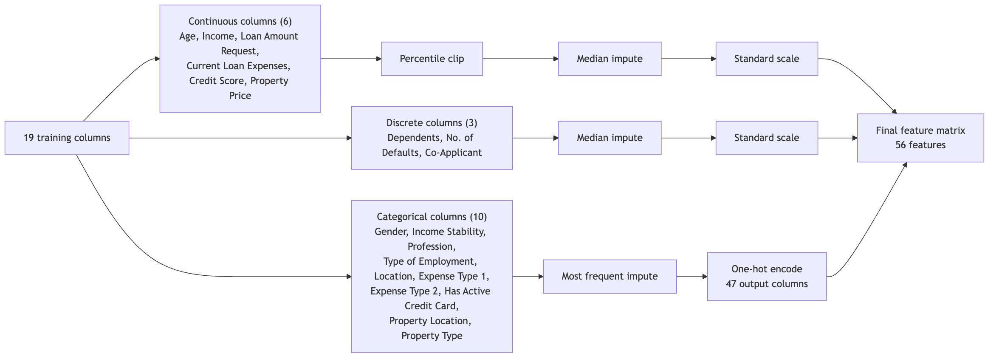
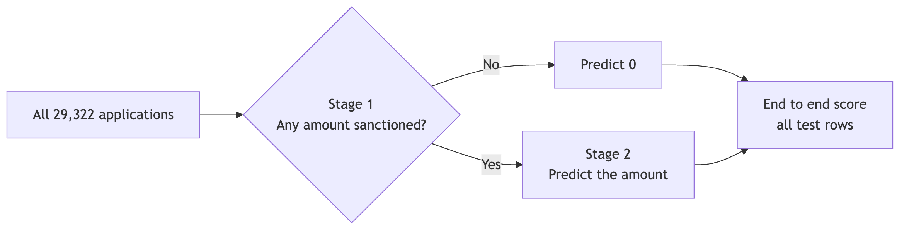
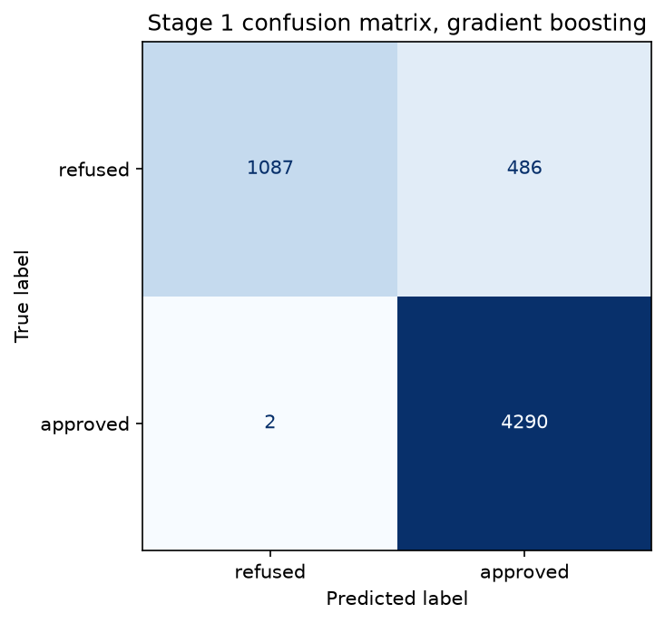
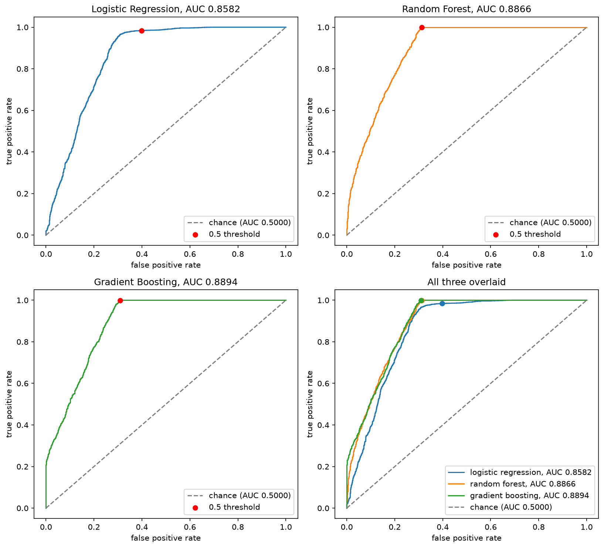

\newpage

# 1. Introduction

## Problem statement and motivation

Someone applying for a loan asks for a certain figure, and the bank almost never
sanctions exactly that figure. Part of the request is usually cut, and a fair
share of applications are refused outright and receive nothing at all. The
applicant normally finds this out only at the end of the process, after weeks of
paperwork.

This project estimates that figure early, from details an applicant already knows
about themselves, such as income, credit score, existing loan expenses and the
price of the property. It is not a lending decision and does not replace the
checks a bank carries out, it is an early estimate so that a person can see
roughly where they stand before committing time to an application.

Two lines of published work make the attempt worthwhile. Khandani et al. [1] show
that machine learning models built on applicant transaction and credit bureau
data forecast consumer delinquency and default considerably better than
traditional scoring methods, so data of this kind carries enough signal to be
modelled directly. Lessmann et al. [2] benchmark 41 classifiers across eight real
credit scoring datasets and find that ensembles beat simpler baselines such as
logistic regression fairly consistently. That second result shapes the method
used here: several classifiers are tuned and compared on one fixed split rather
than one being chosen in advance.

## Goals

1. A model that takes a single application and predicts the sanctioned amount in
   US dollars, together with whether any amount is sanctioned at all.
2. An honest score for it, measured on applications it never saw during training
   and reported end to end rather than on whichever subset flatters each stage.
3. A record of what the raw file contained and which parts of it were unusable.

# 2. Background

The two references above set the terms for this work: [1] is the case that richer
applicant data plus machine learning improves on scorecard style methods, and [2]
is the case that the choice of classifier matters enough to be worth comparing
several on one split instead of defending a favourite.

The decision to try tree ensembles before a neural network is not a matter of
taste. Grinsztajn et al. [3] benchmark both families across many medium-sized
tabular datasets and find that tree-based ensembles still come out ahead of deep
networks on data of this shape. This dataset is tabular with 19 input columns and
under 30,000 rows, so the tree ensembles were tuned first and the network was
added afterwards as the comparison rather than the favourite.

Cragg [4] sets out a two-part model in which whether an outcome is zero is
estimated separately from how large it is when positive. The target column here
behaves exactly that way, because a sanctioned amount of 0 records a refusal
rather than a very small loan. For interpretation, Lundberg and Lee [5] give a
single framework for attributing a prediction to the features that produced it,
with the attributions summing back to the prediction, which is what makes the
SHAP values in Section 4.5 readable as shares of a total. Fuster et al. [6] find
that moving credit underwriting onto machine learning changes outcomes across
demographic groups and in some cases widens existing gaps, and `Gender` is one of
the features used here, which is why fairness appears as an open limitation in
Section 5.

Stage 1 is therefore a binary classifier, tried as logistic regression, a random
forest and a gradient boosting classifier, against a baseline that approves
everyone, since 73.2 percent of this data is approved. Stage 2 is a regressor
fitted only on approved applications, tried as linear regression, a principal
component version of it, two tree ensembles and a PyTorch network, against a mean
predictor.

# 3. Methodology

## 3.1 Tools and the dataset

The work runs on a Python 3.14.4 kernel, with pandas 2.3.3 and numpy 2.4.6 for
data handling and scikit-learn 1.9.0 for every model except the network, so that
preprocessing, grid search and metrics all come from one library. The network is
written in PyTorch 2.9.1, because no TensorFlow wheel is published for Python
3.14.4. Attribution uses shap 0.52.0 and plots matplotlib 3.11.0 and seaborn
0.13.2.

The data is the Kaggle dataset "Predict Loan Amount Data", available at
<https://www.kaggle.com/datasets/phileinsophos/predict-loan-amount-data>. The
file used is `train.csv`, which holds 30,000 applications in 23 columns once
`Customer ID` is set as the index, keeping the identifier out of the feature set.
The column being predicted is `Loan Sanction Amount (USD)`.

## 3.2 Data quality findings

**A numeric sentinel was hiding inside several columns.** `-999` is used in this
file to mean "not recorded", and left in place it reads as a real quantity, so an
unrecorded income would be averaged in with genuine incomes and drag the column
down. Every `-999` was converted to a blank before anything was counted.
`Property Price`, `Co-Applicant` and `Current Loan Expenses (USD)` look almost
complete on a raw null count, yet 352, 168 and 177 of their entries respectively
were the sentinel rather than an empty cell.

**678 rows have no target and were dropped, leaving 29,322.** A missing target
cannot be filled, because filling it would mean inventing the answer and training
the model to reproduce the invention. Of those 678 rows, 338 carried `-999`
rather than a blank.

**One column is an exact duplicate of another.** `Property Age` is not an age. It
is a copy of `Income (USD)`, identical to the cent in all 25,150 rows where both
values are present, giving a correlation of exactly 1.000000. A match that exact
only happens when one column was copied from the other, so `Property Age` was
dropped, along with `Name` and `Property ID`, which are nearly unique per row and
can only be memorised. That leaves 20 columns, 19 of them inputs.

**Over a quarter of the target column is not an amount.** 7,865 applications,
26.8 percent, have a sanctioned amount of exactly 0, against 21,457 that receive
something. A 0 here records a refusal, not a very small loan, and refusals are
not spread at random. An applicant with high income stability is refused 14.8
percent of the time against 29.0 percent for low income stability, and 30.1
percent of rural applicants are refused against 21.8 percent of urban ones.
Refusal is predictable from fields available at application time, so those rows
carry a pattern worth learning rather than noise worth discarding.

`Type of Employment` is absent in 24.30 percent of rows and `Income (USD)` in
15.04 percent. Both are too large to drop, so both are imputed.

## 3.3 Splitting before looking

The split was made before any chart was drawn, because if the rows used for
grading are looked at first then the test set stops measuring generalisation.
23,457 rows go to training and 5,865 to the held-out test set, an 80/20 split of
the 29,322 remaining, stratified on approval status so that the approval rate
lands at 0.732 in both halves.

## 3.4 The preprocessing pipeline

Every transformer sits inside a scikit-learn `Pipeline`, so that under cross
validation it is refit on each training fold and a held-out fold is transformed
using statistics it did not contribute to. The 19 input columns fall into the
three groups shown in Figure 1.

{width=66%}

Two choices there are worth the reason behind them. Nominal categories are
one-hot encoded rather than numbered, because numbering `Profession` as 0, 1, 2
and 3 would tell a linear model that category 3 is three times category 1, which
is not true of a job title. `Property Type` is treated the same way despite being
stored as an integer, since its values are codes rather than a count. Outliers in
the six continuous columns are clipped at the 1st and 99th percentiles rather than
replaced by the column mean, because clipping keeps every row in rank order and
invents nothing. The three discrete count columns skip clipping, because fourteen
dependents is an unusual household rather than a typo.

The pipeline produces 56 features from 19 columns. Refitting it on approved rows
only, as Stage 2 requires, gives 54, because the `Profession` values "Unemployed"
and "Student" appear on only 2 training rows and both were refused.

## 3.5 The two stage design and the metrics

A single regressor fitted over the whole target column has to aim at 0 for a
quarter of the rows and at a five or six figure sum for the rest, so it settles in
between and serves neither group. Following the two-part structure in [4], the
work splits as shown in Figure 2.

{width=56%}

Stage 1 predicts whether anything is sanctioned and Stage 2, trained only on
approved applications, predicts how much. An application that Stage 1 marks as
refused is reported as 0 and never reaches the regressor. The refused rows are
not deleted from the project, because for those applicants 0 is the correct
answer and a model that has never seen a rejection has no way of saying no.

The headline regression metric is RMSE in US dollars, so the error reads as
money, with R2 beside it because a low RMSE on a target that barely varies is not
an achievement. Stage 1 is judged on F1 rather than accuracy, since a model that
approves everyone already scores 0.7318 accuracy here, so accuracy on a split
this uneven mostly measures the split.

# 4. Results

## 4.1 Stage 1, the approval classifier

All four are scored on the 5,865 held-out test rows.

\begin{center}
\begin{tabular}{@{}lrrrrr@{}}
\toprule
Model & Accuracy & Precision & Recall & F1 & ROC-AUC \\
\midrule
Baseline, always approve & 0.7318 & 0.7318 & 1.0000 & 0.8451 & 0.5000 \\
Logistic regression & 0.8805 & 0.8697 & 0.9842 & 0.9234 & 0.8582 \\
Random forest & 0.9158 & 0.8971 & 0.9995 & 0.9456 & 0.8866 \\
Gradient boosting & \textbf{0.9168} & \textbf{0.8982} & 0.9995 & \textbf{0.9462} & \textbf{0.8894} \\
\bottomrule
\end{tabular}
\end{center}

All three tuned models clear the baseline F1 of 0.8451 by a wide margin, and
gradient boosting leads on accuracy, precision, F1 and ROC-AUC together, so it
was kept. Recall of 0.9995 is where the result starts to look less impressive
than the F1 suggests, since approved rows are the easier half of this target and
there are nearly three times as many of them. Precision, at 0.8982, is where the
harder half shows up.

Figure 3 makes the imbalance concrete. The model produces 486 false approvals
against 2 false rejections. Set against the 1,573 applications actually refused
in the test set, roughly 3 in 10 refused applicants are wrongly told a number is
coming, while almost no viable applicant is turned away, at 2 out of 4,292. The
model has learned to say yes, an asymmetry invisible in an F1 of 0.9462 that
drives the rest of the results.

{width=34%}

Figure 4 plots the ROC curve for each tuned classifier, with a marked point at
the default 0.5 threshold where each model actually operates. Random forest and
gradient boosting land at 0.8866 and 0.8894 AUC, only 0.0028 apart, which is why
each gets its own panel rather than being read off one shared curve. On every
curve the 0.5 point sits high, close to a catch rate of 1, so the curve above
that point is mostly trading further recall for false alarms, which is the same
486 to 2 imbalance the confusion matrix already reports. The always-approve
baseline has an AUC of exactly 0.5000, so it is not drawn separately, it is the
diagonal chance line already shown in each panel.

{width=68%}

## 4.2 Stage 2, the amount regressor

Six models are scored on the 4,292 approved test rows.

\begin{center}
\begin{tabular}{@{}lrrr@{}}
\toprule
Model & RMSE (USD) & MAE (USD) & R2 \\
\midrule
Dummy, mean of training target & 44,861.14 & 35,106.15 & -0.0000 \\
Linear regression & 6,339.64 & 3,925.84 & 0.9800 \\
PCA to 10 components, then linear regression & 11,428.85 & 8,066.47 & 0.9351 \\
Random forest & 5,208.24 & 3,230.15 & 0.9865 \\
Gradient boosting & \textbf{5,137.77} & \textbf{3,143.83} & \textbf{0.9869} \\
Neural network, PyTorch MLP & 18,636.00 & 14,464.95 & 0.8274 \\
\bottomrule
\end{tabular}
\end{center}

Gradient boosting wins and becomes the Stage 2 model. Ten principal components
hold 71.23 percent of the variance, which sounds acceptable until RMSE is seen to
rise by 80 percent. The network finishes behind plain linear regression,
consistent with its own training curve, where validation loss reaches its lowest
point at epoch 25 and then climbs while training loss keeps falling, and with the
pattern reported in [3] for tabular data of this size.

**An R2 of 0.9869 is not the achievement it appears to be.** A plain linear
regression fitted on `Loan Amount Request (USD)` alone, with no other column and
no tuning, reaches an RMSE of 6,123.84 USD and an R2 of 0.9814, which is not
worse than the 54-feature linear regression above, it is slightly better. The
random forest agrees, placing 98.05 percent of its feature importance on that one
column. The sanctioned amount is anchored to the requested amount, at a Pearson
correlation of 0.9907 among approved training rows and a median sanctioned share
of exactly 0.700 of what was asked for. The high score here is a property of the
data, not evidence that any model has learned how a bank underwrites a loan.

## 4.3 End to end, the number an applicant would actually see

Stage 1 was scored on all test rows and Stage 2 only on genuinely approved rows,
the set that excludes the mistake costing the most. Chaining the two pipelines
gives the figure a real applicant would receive.

\begin{center}
\begin{tabular}{@{}lrrrr@{}}
\toprule
Setting & Rows scored & RMSE (USD) & MAE (USD) & R2 \\
\midrule
Predicted gate, Stage 1 decides & 5,865 & 22,814.62 & 7,706.60 & 0.7757 \\
Perfect gate, true label decides & 5,865 & 4,395.12 & 2,300.65 & 0.9917 \\
\bottomrule
\end{tabular}
\end{center}

This is the honest number and it is much worse. RMSE rises from 5,137.77 USD to
22,814.62 USD and R2 falls from 0.9869 to 0.7757, which is not the same error
measured over more rows but a genuinely worse one, because a wrong approval costs
an applicant the entire predicted loan amount rather than a percentage of it.
Replacing the model's gate with the true label brings RMSE down to 4,395.12 USD
and lifts R2 to 0.9917, better than Stage 2 on its own subset, because a perfect
gate assigns exactly 0 to every truly refused row and those 1,087 zero-error rows
pull the average down. Almost all of the distance from 4,395.12 to 22,814.62 sits
in Stage 1 choosing the wrong gate.

## 4.4 Where the error comes from

Splitting the squared error by what Stage 1 did with each row gives the sharpest
result in the project.

\begin{center}
\begin{tabular}{@{}lrr@{}}
\toprule
Stage 1 outcome & Rows & Share of total squared error \\
\midrule
Falsely approved & 486 & \textbf{94.81\%} \\
Correctly approved & 4,290 & 3.70\% \\
Falsely rejected & 2 & 1.50\% \\
Correctly refused & 1,087 & 0.00\% \\
\bottomrule
\end{tabular}
\end{center}

The 486 falsely approved rows are 8.3 percent of the test set, and the correctly
refused rows contribute exactly nothing, because reporting 0 for an application
that is truly refused is not a partial hit, it is exact. A handful of
misclassified rows, and not the ordinary spread of regression error, decides
almost the entire end to end score. That says precisely where any further effort
should go.

## 4.5 What each stage relies on

SHAP values [5] were computed on 500 sampled test rows for each stage.

For Stage 1 the top three features are `Credit Score`, `Co-Applicant` and
`Income (USD)`, together holding 74.5 percent of the total SHAP magnitude across
56 features, with mean absolute values of 1.3244, 0.9495 and 0.4657. A low credit
score or the absence of a co-applicant pushes a prediction toward refusal, the
direction a loan officer would expect. The attribution is spread across several
columns, which is the sign that this stage is reading the application.

Stage 2 looks nothing like that. `Loan Amount Request (USD)` alone holds 90.0
percent of the total SHAP magnitude, rising to 98.7 percent once `Credit Score`
and `Property Price` are added. The mean absolute SHAP value for the requested
amount is 34,798.73 against 3,073.61 for credit score and 289.29 for property
price, so the other two nudge the figure rather than shape it. This confirms the
98.05 percent feature importance of Section 4.2 from a second direction.
Neither stage's attribution says a feature causes an outcome, since SHAP only
attributes credit for the prediction this model makes.

# 5. Discussion

## 5.1 Interpretation

Stage 2 posts an R2 of 0.9869 and is the least interesting part of the project,
because the sanctioned amount is anchored to the requested one and a single
column reaches 0.9814 on its own. Stage 1 posts an F1 of 0.9462 and is where the
difficulty sits, because that number hides 486 false approvals against 2 false
rejections. The end to end RMSE of 22,814.62 USD is the figure that should be
quoted, and 8.3 percent of rows carry 94.81 percent of it, every one of them a
Stage 1 mistake. A genuine refusal is far more often reported to an applicant as
an approval with a dollar figure attached than the reverse.

## 5.2 Limitations

**The dataset itself is not fully trustworthy.** It is a Kaggle extract with no
documented provenance, and the audit found `Property Age` to be a column labelled
and shipped as something it is not. One confirmed error of that kind, found only
because it was checked, is reason to treat the rest of the file as unverified.

**Stage 2 is close to a one-feature problem.** This is set out in Section 4.2 and
is the single most important caveat on the headline scores.

**Stage 1 leans toward approval and nothing corrects for it.** The decision
threshold was left at the default 0.5 and no class weighting was applied, so the
486 to 2 asymmetry was accepted as it came out rather than tuned against.

**The neural network overfits and nothing corrects for that either.** Validation
loss reaches its lowest point at epoch 25 and climbs through epoch 50 while
training loss keeps falling, and the network is still scored at epoch 50, because
no early stopping was built into the training loop.

**No fairness audit was carried out, even though `Gender` is a feature of both
stages.** The target is a historical lending decision, so any bias in how those
loans were sanctioned is reproduced rather than corrected. Given the findings in
[6], this is a real gap.

**The model reflects one snapshot of lending behaviour.** It is fitted once on a
fixed file, so if the conditions that produced these 29,322 applications shift,
through interest rates, underwriting rules or the mix of applicants, nothing here
would notice.

## 5.3 Improvements

The error decomposition sets the priority and it points at Stage 1 alone, since
improving Stage 2 further would move 3.70 percent of the error at best.

The first change is to tune the Stage 1 decision threshold rather than leave it
at 0.5. Precision of 0.8982 against recall of 0.9995 is a lopsided trade, and
raising the threshold would convert some of that spare recall into precision.
Because 94.81 percent of the error sits on falsely approved rows, even a small
precision gain should move the end to end RMSE noticeably, and class weighting
would push the same way.

The second is to score the two mistakes differently instead of treating them as
equal, since F1 gives a false approval and a false rejection the same weight but
they cost very different amounts. A cost-sensitive objective would rank Stage 1
candidates closer to the way the chained system is actually judged.

The third is a fairness audit across `Gender` and the other applicant attributes,
comparing refusal rates and sanctioned amounts with the remaining columns held
fixed. Adding early stopping to the network is worth doing as well, though on the
evidence in [3] it would not overtake the tree ensembles here.

# 6. Conclusion

## 6.1 What was achieved

A two stage model predicts the loan amount an applicant is likely to have
sanctioned. Stage 1 reaches an F1 of 0.9462 and Stage 2 an R2 of 0.9869 on
held-out data, and chained together they give an end to end RMSE of 22,814.62 USD
and an R2 of 0.7757 across all 5,865 test rows. The project also produced a data quality audit that found an exact
duplicate column and a numeric sentinel, an error decomposition locating 94.81
percent of the error in 8.3 percent of the rows and a SHAP analysis showing that
Stage 2 rests on one input column.

## 6.2 Lessons learned

A good score can be a property of the data rather than of the model. Stage 2's R2
of 0.9869 looked like the strongest result in the project until a one-column
regression reached 0.9814, at which point the score turned into a description of
how the target is constructed.

The scoring subset also decides the story, since each stage scored on its own
rows is flattering and only the chained evaluation answers what an applicant
would experience. An F1 of 0.9462 likewise gives no hint of a 486 to 2 imbalance,
which only the confusion matrix and the error decomposition exposed.

## 6.3 Individual contributions

\begin{center}
\begin{tabular}{@{}lp{10.6cm}@{}}
\toprule
Member & Contribution \\
\midrule
Kushal Krishnappa & Data quality audit and the preprocessing pipeline, including sentinel handling, the duplicate column finding, clipping and encoding \\
Deepak & Exploratory data analysis and all figures, from univariate through to correlation analysis \\
Rohit & Stage 1 classifier, the threshold and metric choice and the end to end evaluation \\
Dips & Stage 2 regressors including the PyTorch network, plus the SHAP interpretation \\
\bottomrule
\end{tabular}
\end{center}

Report writing and final review were shared across all four members.

# 7. References

[1] A. E. Khandani, A. J. Kim and A. W. Lo, "Consumer credit-risk models via
machine-learning algorithms", *Journal of Banking & Finance*, 2010.
<https://www.sciencedirect.com/science/article/abs/pii/S0378426610002372>

[2] S. Lessmann, B. Baesens, H.-V. Seow and L. C. Thomas, "Benchmarking
state-of-the-art classification algorithms for credit scoring: An update of
research", *European Journal of Operational Research*, 2015.
<https://www.sciencedirect.com/science/article/abs/pii/S0377221715004208>

[3] L. Grinsztajn, E. Oyallon and G. Varoquaux, "Why do tree-based models still
outperform deep learning on typical tabular data?", *Advances in Neural
Information Processing Systems (NeurIPS), Datasets and Benchmarks Track*, 2022.
<https://arxiv.org/abs/2207.08815>

[4] J. G. Cragg, "Some Statistical Models for Limited Dependent Variables with
Application to the Demand for Durable Goods", *Econometrica*, 1971.
<https://www.econometricsociety.org/publications/econometrica/1971/09/01/some-statistical-models-limited-dependent-variables-application>

[5] S. M. Lundberg and S.-I. Lee, "A Unified Approach to Interpreting Model
Predictions", *Advances in Neural Information Processing Systems (NeurIPS)*,
2017. <https://arxiv.org/abs/1705.07874>

[6] A. Fuster, P. Goldsmith-Pinkham, T. Ramadorai and A. Walther, "Predictably
Unequal? The Effects of Machine Learning on Credit Markets", *The Journal of
Finance*, 2022. <https://onlinelibrary.wiley.com/doi/abs/10.1111/jofi.13090>
